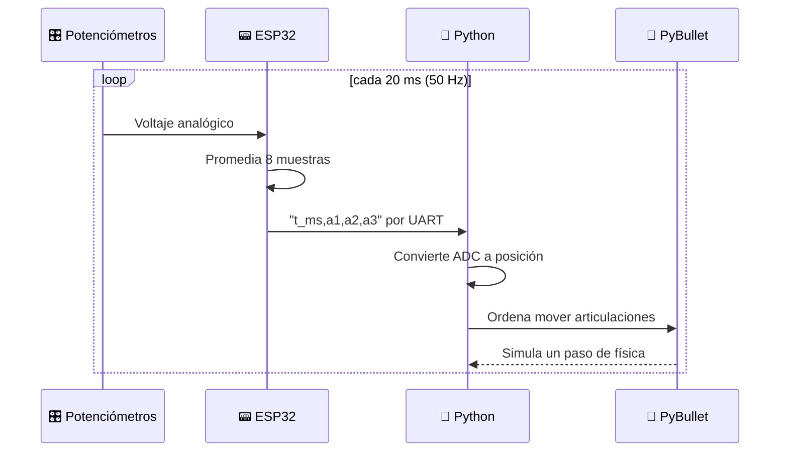

# tarea-5-micros
<div align="center">

# 🦾 Brazo Robótico Controlado con ESP32

### Mueve un robot 3D en tiempo real girando tres perillas


**Universidad Militar Nueva Granada** · Actividad 5

</div>

---

## 🎬 Mira cómo funciona

<div align="center">

[](https://youtu.be/ID_DEL_VIDEO)

**[▶ Ver el video en YouTube](https://youtu.be/ID_DEL_VIDEO)**

</div>

---

## 💡 ¿De qué trata?

Un **ESP32** lee tres potenciómetros y le envía sus valores al computador por USB. Un programa en **Python** convierte esos valores en movimientos de un **brazo robótico con pinza** que se ve en 3D dentro de **PyBullet**.

<div align="center">

| 🎛️ Perilla | 🤖 Qué mueve en el robot |
|:---:|:---:|
| **Potenciómetro 1** | Gira la base |
| **Potenciómetro 2** | Sube y baja el codo |
| **Potenciómetro 3** | Abre y cierra la pinza |

</div>

---

## ⚡ Inicio rápido

¿Ya tienes el ESP32 cargado y conectado? Con esto lo ves funcionando:

```bash
pip install pybullet pyserial
python control_brazo.py --port COM3
```

¿Aún no tienes el hardware? Pruébalo sin nada conectado:

```bash
python control_brazo.py --sim
```

> El brazo se moverá solo con señales simuladas.

Más detalles en las secciones siguientes 👇

---

## 🔄 Cómo se comunican las piezas



---

## 🔌 Armado del circuito

### Lo que necesitas

- ✅ 1 ESP32 DevKit
- ✅ 3 potenciómetros de 10 kΩ
- ✅ Protoboard y cables
- ✅ Cable USB **con datos** (algunos cables solo cargan)

### Conexiones

| 🎛️ Potenciómetro | Extremo 1 | Pin central | Extremo 2 |
|:---:|:---:|:---:|:---:|
| **1** | 3V3 | **GPIO 34** | GND |
| **2** | 3V3 | **GPIO 35** | GND |
| **3** | 3V3 | **GPIO 32** | GND |

> ⚠️ Alimenta todo con **3V3**, nunca con 5V.

> 🕹️ **¿Tienes un joystick en vez del tercer potenciómetro?** Conecta su VRx al GPIO 32, su VCC a 3V3 y su GND a GND. Con el código original la pinza se controla por velocidad: empujar abre o cierra, y soltar la deja quieta.

### Pasos

1. Coloca el ESP32 en la protoboard.
2. Lleva 3V3 y GND a los rieles de la protoboard.
3. Monta los tres potenciómetros y conecta los pines centrales a los GPIO de la tabla.
4. Conecta el ESP32 al computador.

---

## 📟 Paso 1 · Cargar el firmware

El archivo es `Brazo/Brazo.ino`.

1. Abre **Arduino IDE 2.x**.
2. Agrega el soporte de ESP32 (solo la primera vez):
   - *Archivo → Preferencias → Gestor de URLs adicionales* y pega:
     ```
     https://espressif.github.io/arduino-esp32/package_esp32_index.json
     ```
   - *Herramientas → Placa → Gestor de tarjetas* → busca **esp32** e instala el de *Espressif Systems*.
3. Abre `Brazo/Brazo.ino` con *Archivo → Abrir*.
4. Elige *Herramientas → Placa → ESP32 Dev Module* y tu puerto COM.
5. Pulsa ✔ **Verificar** y luego → **Subir**.
6. Si ves `Connecting.....`, mantén presionado el botón **BOOT** del ESP32.

**¿Cómo sé que funciona?** Abre el *Monitor Serie* a **115200** baudios y gira los potenciómetros. Deben cambiar líneas como:

```
15320,2048,1990,510
```

Después **ciérralo**, porque si queda abierto bloquea el puerto.

<details>
<summary><b>📖 ¿Qué significa cada número?</b></summary>

<br>

| Campo | Significado |
|:---:|---|
| `15320` | Milisegundos desde que arrancó el ESP32 |
| `2048` | Potenciómetro 1 (0 a 4095) |
| `1990` | Potenciómetro 2 (0 a 4095) |
| `510` | Potenciómetro 3 (0 a 4095) |

El ADC trabaja a 12 bits con atenuación de 11 dB, así que 0 equivale a 0 V y 4095 a unos 3.3 V.

</details>

---

## 🐍 Paso 2 · Ejecutar el control en Python

**1. Crear y activar el entorno virtual**

```bash
python -m venv venv
venv\Scripts\activate          # Windows
source venv/bin/activate       # Linux / macOS
```

**2. Instalar las librerías**

```bash
pip install pybullet pyserial
```

**3. Comprobar que el robot carga**

```bash
python main.py
```

Se abre la ventana 3D con el brazo y la consola lista sus 5 articulaciones.

**4. Ejecutar con el ESP32**

```bash
python control_brazo.py --port COM3
```

> Cambia `COM3` por tu puerto. Lo ves en el Administrador de dispositivos (Windows) o con `ls /dev/ttyUSB*` (Linux).

Para terminar, presiona `Ctrl + C`.

### 🎚️ Opciones disponibles

| Opción | Para qué sirve |
|---|---|
| `--port COM3` | Indica el puerto del ESP32 |
| `--sim` | Corre sin hardware, con señales simuladas |
| `--invertir-pinza` | Invierte el sentido de apertura de la pinza |
| `--baud 115200` | Cambia la velocidad serial |
| `--urdf archivo.urdf` | Usa otro modelo de robot |

---

## 🧮 Cómo se calcula cada movimiento

Cada valor del ADC se convierte en una posición usando los límites que trae el URDF:

```
posición = límite_inferior + (ADC / 4095) × (límite_superior − límite_inferior)
```

| Articulación | Tipo | Rango |
|---|:---:|:---:|
| `joint_1` (base) | Giro | −2.5 a 2.5 rad |
| `joint_2` (codo) | Giro | −2.0 a 2.0 rad |
| `joint_dedo_izq` | Desliza | 0 a 0.05 m |
| `joint_dedo_der` | Desliza | 0 a 0.05 m |

La pinza usa el mismo cálculo con el potenciómetro 3, así que ambos dedos se mueven a la vez y de forma simétrica.

---

## ⏱️ ¿Cómo compruebo que es tiempo real?

Mientras corre, la consola imprime cada segundo algo como:

```
ADC=(2048,1990, 510)  pinza=0.12  dedo=0.006 m  tasa: 49.8 Hz
```

Si la **tasa** está cerca de **50 Hz**, el sistema sigue el ritmo de muestreo del ESP32. Esa línea sirve como evidencia en el video.

---

## 🛠️ ¿Algo no funciona?

<details>
<summary><b>❌ <code>could not open port</code></b></summary>

<br>

Cierra el Monitor Serie de Arduino IDE y revisa que el número de puerto COM sea el correcto.

</details>

<details>
<summary><b>❌ No aparece el puerto COM</b></summary>

<br>

Instala el driver del chip USB de tu placa (CP2102 o CH340) o prueba con otro cable, porque algunos solo cargan la batería.

</details>

<details>
<summary><b>❌ <code>Failed to connect</code> al subir el código</b></summary>

<br>

Mantén presionado el botón **BOOT** del ESP32 mientras aparece `Connecting.....`.

</details>

<details>
<summary><b>❌ El brazo no se mueve</b></summary>

<br>

Revisa en el Monitor Serie que lleguen datos que cambien al girar los potenciómetros. Si no cambian, el problema está en el cableado o en el firmware.

</details>

<details>
<summary><b>❌ La pinza abre al revés</b></summary>

<br>

Ejecuta con `python control_brazo.py --port COM3 --invertir-pinza`.

</details>

<details>
<summary><b>❌ <code>pybullet</code> no se instala</b></summary>

<br>

Usa Python 3.11 o 3.12. Las versiones más nuevas a veces no tienen el paquete precompilado.

</details>

---

## 🗂️ ¿Qué hay en cada archivo?

```
📁 proyecto
├── 📁 Brazo
│   └── 📄 Brazo.ino        → Firmware del ESP32 (lee y envía los datos)
├── 📄 brazo.urdf           → Modelo 3D del robot
├── 📄 control_brazo.py     → Programa principal de control
├── 📄 main.py              → Prueba rápida del modelo
├── 📄 .gitignore           → Evita subir el entorno virtual
└── 📄 README.md
```

---

<div align="center">

### 👤 Autor

**[Nombre del estudiante]**
Universidad Militar Nueva Granada · Actividad 5

</div>
